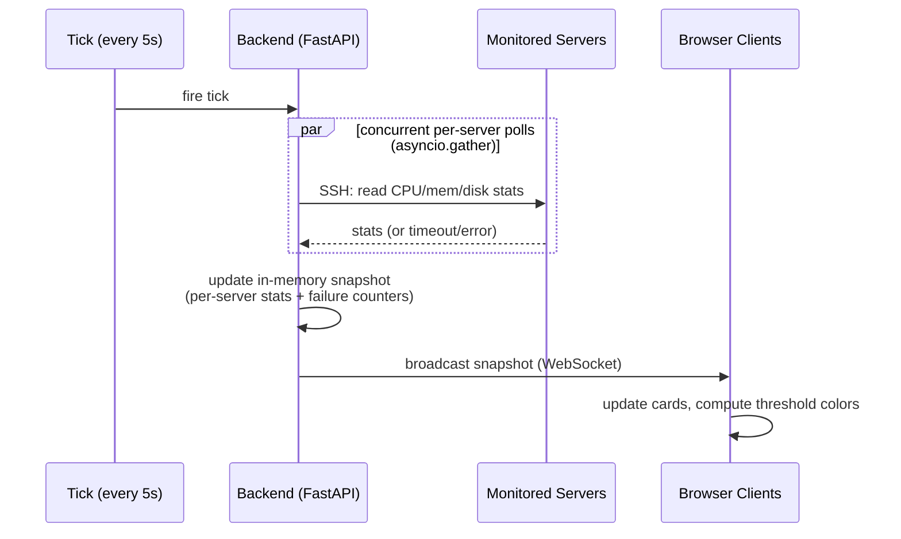

# System Design

One level of detail down from `docs/architecture.md`: how the three pieces
behave, not yet what their exact API contract looks like (that's
`docs/api-design.md`, written after this and the Figma mockups).

## Component responsibilities

**Monitored servers** — passive. Each runs a restricted, non-root `monitor`
user whose only job is to answer the stat-reading commands the backend sends
over SSH (CPU%, memory usage, disk usage).

**Backend (FastAPI)**
- Holds one persistent `asyncssh` connection per monitored server, opened
  once (not reopened every poll) and reused across poll cycles.
- Drives a single global polling tick. On every tick, polls all servers
  concurrently and updates an in-memory state snapshot (latest stats +
  reachability per server).
- Broadcasts the full snapshot to every connected WebSocket client on every
  tick.
- Is the only component with SSH credentials — the single trust boundary
  between the dashboard and the monitored fleet.

**Frontend (React)**
- Connects to the backend's WebSocket route after login, renders one card
  per server, and updates all cards in place as new snapshots arrive.
- Computes threshold color (green/yellow/red) client-side from the raw
  numeric values the backend sends — the backend stays a dumb data pipe,
  it doesn't know about UI thresholds.

## End-to-end data flow

1. A global timer fires every **5 seconds** (the polling interval).
2. For each configured server, a coroutine runs the stat-reading commands
   over that server's existing `asyncssh` connection.
3. All per-server coroutines run concurrently via `asyncio.gather(...,
   return_exceptions=True)` — one server's failure doesn't cancel the others
   or stall their results.
4. A successful poll updates that server's entry in the in-memory state
   (stats + reset its consecutive-failure counter). A failed poll increments
   that server's consecutive-failure counter instead.
5. Once the tick's `gather()` resolves, the backend assembles a snapshot of
   every server's current state and broadcasts it to all connected WebSocket
   clients.
6. The frontend receives the snapshot, updates its server cards, and
   recomputes each card's threshold color from the raw values.

## Polling & concurrency model

- One global 5-second tick drives every server's poll together — there is
  no independent per-server timer. This keeps the model simple: "what does
  the fleet look like right now" is always a single, consistent snapshot.
- `asyncio.gather` is what makes concurrency across servers possible: all
  per-server poll coroutines are scheduled on the same event loop and run
  interleaved, so polling 20 servers takes roughly as long as polling 1
  (bounded by the slowest one), not 20x as long.
- `gather` alone isn't sufficient, though — it only isolates *failures*
  (via `return_exceptions=True`), not *slowness*. A single server whose SSH
  session hangs would otherwise stall that entire tick, since `gather`
  waits for every coroutine to finish. Each per-server poll is therefore
  wrapped in its own `asyncio.wait_for(..., timeout=...)` (timeout shorter
  than the 5s tick), so a hung session is treated as a failure for that
  tick instead of blocking everyone else's results.

## Reconnection & error handling

**SSH side (per monitored server)**
- No separate backoff timer — a dropped or failing connection is simply
  retried on the next global tick, piggybacking on the existing 5s cadence.
- Each server has a consecutive-failure counter. After **3 consecutive
  failures** (~15 seconds of downtime), that server is marked
  **unreachable** in the snapshot, which the frontend will render as a
  distinct "unreachable" card state (not one of the normal threshold
  colors).
- The counter resets to zero on the next successful poll — no separate
  recovery grace period, a single success is enough to mark it healthy
  again.

**WebSocket side (browser dashboard)**
- The backend keeps no per-client history — every broadcast is a full,
  self-contained snapshot. This means a freshly (re)connected client needs
  no replay or catch-up logic; it just receives the next tick's snapshot
  like any other client.
- Reconnection is therefore the frontend's responsibility: on disconnect,
  it reconnects with exponential backoff (capped), and resumes rendering
  from the next snapshot it receives. The backend doesn't need to track
  anything special about a client that drops and comes back.

## UI wireframes (Stage 3)

Boxes-and-labels wireframes, grayscale only — real colors/typography come in
the higher-fidelity mockup pass that follows this.

- **Login screen**: [Figma](https://www.figma.com/design/FKJ5IiSsPLvauzBTUYSuhi) —
  "W.A.T.C.H — Wireframes" file, frame `1 - Login`.
- **Dashboard** (header + server card grid): `docs/wireframes/dashboard.excalidraw`
- **Card states** (Normal / Warning / Critical / Unreachable, side by side):
  `docs/wireframes/card-states.excalidraw`

The Dashboard and Card States screens moved to Excalidraw mid-stage after
hitting the Figma MCP integration's plan-level rate limit (Starter plan:
6 tool calls/month) — the Login screen stays in Figma since it was already
built and verified before that limit was hit. Open the `.excalidraw` files at
[excalidraw.com](https://excalidraw.com) (Open → select file) or a
self-hosted instance.

Card states confirm the two decisions made for this stage: a threshold
breach recolors the **whole card** (not just the offending metric), and an
**unreachable** server gets a distinct dashed/muted treatment rather than
reusing the critical-red styling.

## Explicitly out of scope for this doc

- Exact WebSocket/REST message shapes and field names — `docs/api-design.md`.
- What happens to an in-flight connection when a JWT expires mid-session —
  an auth-contract detail that belongs with the rest of the API design.
- UI states/layout — Figma, then `docs/api-design.md` once the UI reveals
  what fields are actually needed.
